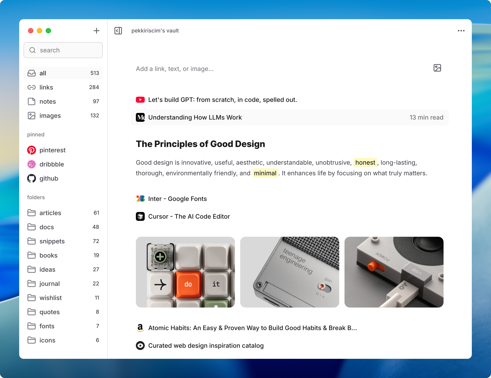

# vault

save links, notes, and images. private & open source.

vault is a desktop app to collect and organize links, notes, and images. it’s open source, private, and everything is stored locally.



## installation

### desktop app

download the latest release for **mac, windows, or linux** from the [releases page](https://github.com/pekkiriscim/vault/releases).

on mac, since the app is not signed, you may need to allow it manually:

```sh
xattr -dr com.apple.quarantine /Applications/vault.app
```

### browser extension

download the latest browser extension build from the [releases page](https://github.com/pekkiriscim/vault/releases).

for chrome or chromium-based browsers, open `chrome://extensions`, enable developer mode, click “load unpacked” and select the extracted chrome build.

for firefox, open `about:debugging#/runtime/this-firefox`, click “load temporary add-on” and select the firefox extension `.zip`.

## features

**folders & multiple vaults**\
organize your content with folders and separate vaults

**search**\
find anything in your saved links and notes instantly

**browser extension**\
save links, notes, and images directly from your browser

**markdown support**\
write notes with formatting, lists, code blocks, and more

**import & export**\
move bookmarks in and out, including from Chrome

**metadata parsing**\
auto-fetch titles, read time, or product info when saving links

## how it works

**set up your vault**\
create a vault, add folders, start saving

<video src="assets/recordings/set-up-your-vault.mp4" autoplay loop muted playsinline width="100%"></video>

**save from your browser**\
add links, notes, images with the extension

<video src="assets/recordings/save-from-your-browser.mp4" autoplay loop muted playsinline width="100%"></video>

**search & manage**\
find, rename, and pin your saved items

<video src="assets/recordings/search-and-manage.mp4" autoplay loop muted playsinline width="100%"></video>

## faq

**is vault free to use?**\
yes, vault is open source and free.

**where is my data stored?**\
all your data is stored locally on your computer inside your vault folder.

**does vault track or collect my data?**\
no. vault doesn’t collect or track anything. your data stays with you.

**do i need an internet connection to use vault?**\
no. vault works entirely offline on your computer.

**does vault support sync?**\
no. vault doesn’t have built-in sync, but you can manually sync your vault folder using cloud storage if you prefer.

**how does the browser extension work?**\
the extension sends links, notes, and images to your local vault via a local api.

**can i import my bookmarks?**\
yes. you can import and export bookmarks from browsers like chrome.

**can i create multiple vaults?**\
yes. you can create and manage as many vaults as you need.

**can i back up or move my vault?**\
yes. vaults are just folders on your computer. you can copy, move, or back them up anywhere.

**what platforms does vault support?**\
vault is available for mac, windows, and linux.

**do images lose quality when added?**\
no. images are saved in their original quality without compression.

**how can i contribute or report bugs?**\
you can contribute or report issues on vault’s github repository.

## contributing

contributions are welcome. feel free to open issues or submit pull requests.

## license

this project is licensed under the [mit license](/LICENSE).

## support

if you like vault, you can support development by [buying me a coffee](https://buymeacoffee.com/pekkiriscim).
